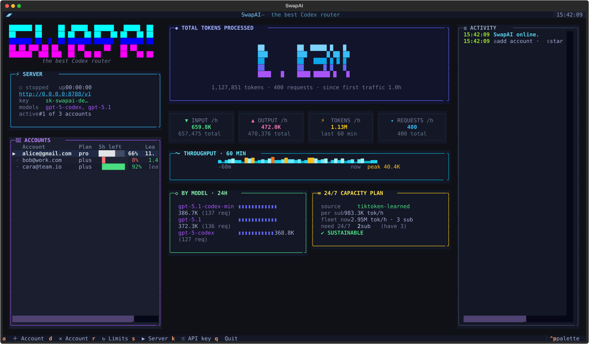

# SwapAI

> Route one OpenAI-compatible endpoint across multiple Codex (ChatGPT) OAuth accounts.

SwapAI combines a Textual dashboard, a FastAPI proxy, automatic account
failover, rate-limit monitoring, and local usage analytics. It is intended for
people who already have access to Codex through ChatGPT and want a single local
endpoint for OpenAI-compatible clients.



## What it does

- Connects multiple ChatGPT accounts with the Codex CLI OAuth/PKCE flow.
- exposes OpenAI-compatible model, Chat Completions, and Responses endpoints.
- Selects an available account and moves to the next account after a rate limit.
- Reports the model intersection shared by all connected accounts.
- Tracks primary (usually five-hour) and secondary (usually weekly) limits.
- Records local request and token totals, including per-model/account breakdowns.
- Learns approximate account capacity from observed traffic and limit movement.
- Runs as an interactive TUI or as a headless API server.

## Requirements

- Python 3.11 or newer
- A ChatGPT account with Codex access
- A browser for the initial OAuth login

## Quick start

```bash
git clone <repository-url>
cd SwapAPI
python -m venv .venv
```

Activate the environment:

```bash
# Linux/macOS
source .venv/bin/activate

# Windows PowerShell
.venv\Scripts\Activate.ps1
```

Install and launch:

```bash
python -m pip install -e .
swapai
```

In the TUI:

1. Press **A** and complete login in the browser.
2. Press **K** to generate or set an API key. This is strongly recommended
   before exposing the server beyond localhost.
3. The API starts automatically after an account has been configured. Press
   **S** to stop or restart it.
4. Point a client at `http://127.0.0.1:8788/v1` (or your configured address).

After at least one account has been connected in the TUI, the server can run
without the dashboard:

```bash
swapai serve
# Equivalent: python -m swapai serve
```

## Make a request

```bash
curl http://127.0.0.1:8788/v1/chat/completions \
  -H "Authorization: Bearer $SWAPAI_API_KEY" \
  -H "Content-Type: application/json" \
  -d '{
    "model": "gpt-5.4",
    "messages": [{"role": "user", "content": "Hello!"}]
  }'
```

Native Responses requests are streamed as server-sent events:

```bash
curl -N http://127.0.0.1:8788/v1/responses \
  -H "Authorization: Bearer $SWAPAI_API_KEY" \
  -H "Content-Type: application/json" \
  -d '{"model":"gpt-5.4","input":"Explain OAuth PKCE briefly."}'
```

See the [API reference](docs/api.md) for all routes and compatibility notes.

## TUI shortcuts

| Key | Action |
| --- | --- |
| `a` | Add an account with browser OAuth |
| `d` | Delete the selected local account credentials |
| `r` | Refresh tokens, models, and limit information |
| `s` | Start or stop the API server |
| `k` | Set or generate the network API key |
| `q` | Quit |

## Configuration

SwapAI reads `~/.swapai/.env` and then a project-local `.env` (the local file
wins). Supported variables are:

```dotenv
SWAPAI_API_KEY=sk-swapai-change-me
SWAPAI_HOST=127.0.0.1
SWAPAI_PORT=8788
SWAPAI_CODEX_CLIENT_VERSION=0.133.0
```

The default host is `0.0.0.0`, which listens on every interface. If no API key
is configured, API routes are open to anyone who can reach the server (except
that `/health` is intentionally public in either case). Use `127.0.0.1` unless
LAN access is required.

Read [configuration and storage](docs/configuration.md) before deploying on a
shared machine or network.

## Client setup

Any client that supports OpenAI Chat Completions or Responses can use SwapAI as
its base URL. For Pi, add a provider to `~/.pi/agent/models.json`:

```json
{
  "providers": {
    "swapai": {
      "baseUrl": "http://127.0.0.1:8788/v1",
      "api": "openai-responses",
      "apiKey": "sk-swapai-change-me",
      "models": [
        {
          "id": "gpt-5.4",
          "name": "GPT-5.4 via SwapAI",
          "reasoning": true,
          "input": ["text", "image"],
          "contextWindow": 272000,
          "maxTokens": 128000
        }
      ]
    }
  }
}
```

Use a model returned by `GET /v1/models`; availability depends on the connected
accounts. Then run:

```bash
pi --provider swapai --model gpt-5.4
```

## Documentation

| Guide | Contents |
| --- | --- |
| [Documentation index](docs/README.md) | Map of all project documentation |
| [Getting started](docs/getting-started.md) | Installation, login, and first request |
| [Configuration](docs/configuration.md) | Environment variables, files, and security |
| [API reference](docs/api.md) | Routes, authentication, payloads, and errors |
| [Architecture](docs/architecture.md) | Components, routing, limits, and data flow |
| [Troubleshooting](docs/troubleshooting.md) | Common startup, OAuth, model, and API issues |
| [Development](docs/development.md) | Repository layout, tests, and contribution flow |

## Important limitations

- SwapAI is not an official OpenAI product. It uses the public Codex CLI OAuth
  client and ChatGPT Codex backend conventions; upstream behavior can change.
- The Chat Completions adapter currently returns a non-streaming response. Use
  `/v1/responses` for native SSE streaming.
- Limit percentages come from `x-codex-*` response headers. Token capacities
  are estimates learned from local traffic, seeded by heuristics in
  `swapai/usage.py`; they are not published plan guarantees.
- Account files contain OAuth credentials in plain JSON under the current
  user's home directory. Protect that directory and never commit its contents.
- You are responsible for complying with OpenAI's terms and the rules that
  apply to each connected account.

## Development

```bash
python -m pip install -e .
python -m pip install pytest
pytest -q
```

The current test suite does not require live OpenAI credentials. See
[docs/development.md](docs/development.md) for module ownership and testing
notes.

## License

Licensed under the terms in [LICENSE](LICENSE).
